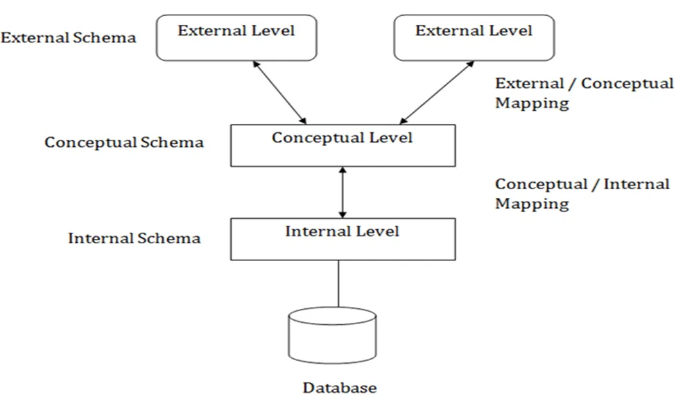
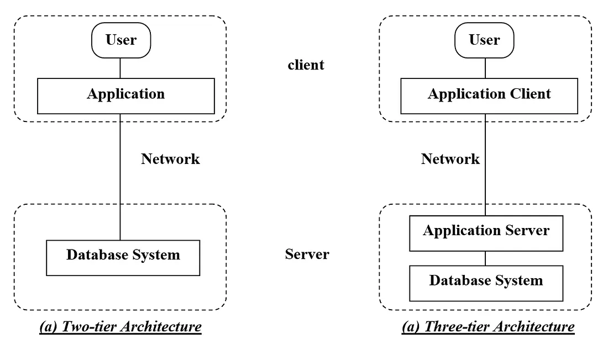

# LEC-2: Architecture of DBMS

## 1. View of Data (Three Schema Architecture)

The major purpose of DBMS is to provide users with an abstract view of the data. That is, the system hides certain details of how the data is stored and maintained.

To simplify user interaction with the system, abstraction is applied through several levels of abstraction.

The main objective of three level architecture is to enable multiple users to access the same data with a personalized view while storing the underlying data only once.

### a. Physical Level / Internal Level

- The lowest level of abstraction describes how the data are stored.
- Low-level data structures used.
- It has Physical schema which describes physical storage structure of DB.
- Talks about: Storage allocation (N-ary tree etc), Data compression & encryption etc.
- **Goal:** We must define algorithms that allow efficient access to data.

### b. Logical Level / Conceptual Level

- The conceptual schema describes the design of a database at the conceptual level, describes what data are stored in DB, and what relationships exist among those data.
- User at logical level does not need to be aware about physical-level structures.
- DBA, who must decide what information to keep in the DB use the logical level of abstraction.
- **Goal:** Ease to use.

### c. View Level / External Level

- Highest level of abstraction aims to simplify users' interaction with the system by providing different view to different end-user.
- Each view schema describes the database part that a particular user group is interested and hides the remaining database from that user group.
- At the external level, a database contains several schemas that sometimes called as subschema. The subschema is used to describe the different view of the database.
- Views also provide a security mechanism to prevent users from accessing certain parts of DB.

---

## 2. Instances and Schemas

- The collection of information stored in the DB at a particular moment is called an **instance** of DB.
- The overall design of the DB is called the **DB schema**.
- Schema is structural description of data. Schema doesn't change frequently. Data may change frequently.
- DB schema corresponds to the variable declarations (along with type) in a program.
- We have 3 types of Schemas: Physical, Logical, several view schemas called subschemas.
- Logical schema is most important in terms of its effect on application programs, as programmers construct apps by using logical schema.
- **Physical data independence:** physical schema change should not affect logical schema/application programs.

---

## 3. Data Models

- Provides a way to describe the design of a DB at logical level.
- Underlying the structure of the DB is the Data Model; a collection of conceptual tools for describing data, data relationships, data semantics & consistency constraints.
- E.g., ER model, Relational Model, object-oriented model, object-relational data model etc.

---

## 4. Database Languages

- **Data definition language (DDL)** to specify the database schema.
- **Data manipulation language (DML)** to express database queries and updates.
- Practically, both language features are present in a single DB language, e.g., SQL language.

### DDL

- We specify consistency constraints, which must be checked, every time DB is updated.

### DML

- Data manipulation involves:
  1. Retrieval of information stored in DB.
  2. Insertion of new information into DB.
  3. Deletion of information from the DB.
  4. Updating existing information stored in DB.
- Query language, a part of DML to specify statement requesting the retrieval of information.

---

## 5. How is Database Accessed from Application Programs?

- Apps (written in host languages, C/C++, Java) interacts with DB.
- E.g., Banking system's module generating payrolls access DB by executing DML statements from the host language.
- API is provided to send DML/DDL statements to DB and retrieve the results.
  - i. Open Database Connectivity (ODBC), Microsoft "C".
  - ii. Java Database Connectivity (JDBC), Java.

---

## 6. Database Administrator (DBA)

- A person who has central control of both the data and the programs that access those data.

### Functions of DBA

- i. Schema Definition
- ii. Storage structure and access methods.
- iii. Schema and physical organization modifications.
- iv. Authorization control.
- v. Routine maintenance:
  1. Periodic backups.
  2. Security patches.
  3. Any upgrades.

---

## 7. DBMS Application Architectures

Client machines, on which remote DB users work, and server machines on which DB system runs.

### a. T1 Architecture

- The client, server & DB all present on the same machine.

### b. T2 Architecture

- App is partitioned into 2-components.
- Client machine, which invokes DB system functionality at server end through query language statements.
- API standards like ODBC & JDBC are used to interact between client and server.

### c. T3 Architecture

- App is partitioned into 3 logical components.
- Client machine is just a frontend and doesn't contain any direct DB calls.
- Client machine communicates with App server, and App server communicates with DB system to access data.
- Business logic, what action to take at that condition is in App server itself.
- T3 architecture are best for WWW Applications.
- **Advantages:**
  1. Scalability due to distributed application servers.
  2. Data integrity, App server acts as a middle layer between client and DB, which minimize the chances of data corruption.
  3. Security, client can't directly access DB, hence it is more secure.

