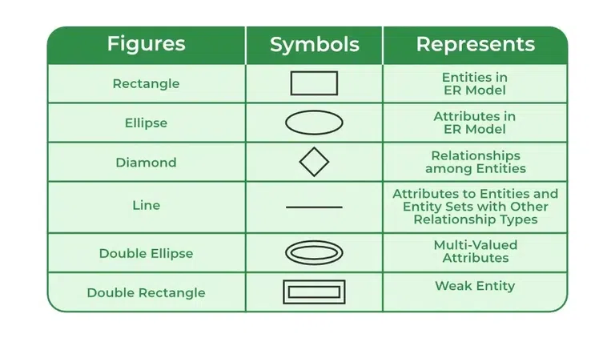

# LEC-3: ER Model

## 1. Data Model

Collection of conceptual tools for describing data, data relationships, data semantics, and consistency constraints.

---

## 2. ER Model

- It is a high level data model based on a perception of a real world that consists of a collection of basic objects, called entities and of relationships among these objects.
- Graphical representation of ER Model is ER diagram, which acts as a blueprint of DB.
- It has physical existence.

---

## 3. Entity

An Entity is a "thing" or "object" in the real world that is distinguishable from all other objects.

- Each student in a college is an entity.
- Entity can be uniquely identified. (By a primary attribute, aka Primary Key)
- **Strong Entity:** Can be uniquely identified.
- **Weak Entity:** Can't be uniquely identified, depends on some other strong entity.
  1. It doesn't have sufficient attributes, to select a uniquely identifiable attribute.
  2. Loan -> Strong Entity, Payment -> Weak, as instalments are sequential number counter can be generated separate for each loan.
  3. Weak entity depends on strong entity for existence.

---

## 4. Entity Set

- It is a set of entities of the same type that share the same properties, or attributes.
- E.g., Student is an entity set.
- E.g., Customer of a bank

---

## 5. Attributes

- An entity is represented by a set of attributes.
- Each entity has a value for each of its attributes.
- For each attribute, there is a set of permitted values, called the domain, or value set, of that attribute.
- E.g., Student Entity has following attributes:
  - A. Student_ID
  - B. Name
  - C. Standard
  - D. Course
  - E. Batch
  - F. Contact number
  - G. Address

### Types of Attributes

1. **Simple**
   - Attributes which can't be divided further.
   - E.g., Customer's account number in a bank, Student's Roll number etc.

2. **Composite**
   - Can be divided into subparts (that is, other attributes).
   - E.g., Name of a person, can be divided into first-name, middle-name, last-name.
   - If user wants to refer to an entire attribute or to only a component of the attribute.
   - Address can also be divided, street, city, state, PIN code.

3. **Single-valued**
   - Only one value attribute.
   - e.g., Student ID, loan-number for a loan.

4. **Multi-valued**
   - Attribute having more than one value.
   - e.g., phone-number, nominee-name on some insurance, dependent-name etc.
   - Limit constraint may be applied, upper or lower limits.

5. **Derived**
   - Value of this type of attribute can be derived from the value of other related attributes.
   - e.g., Age, loan-age, membership-period etc.

6. **NULL Value**
   - An attribute takes a null value when an entity does not have a value for it.
   - It may indicate "not applicable", value doesn't exist. e.g., person having no middle-name.
   - It may indicate "unknown".
     1. Unknown can indicate missing entry, e.g., name value of a customer is NULL, means it is missing as name must have some value.
     2. Not known, salary attribute value of an employee is null, means it is not known yet.

---

## 6. Relationships

- Association among two or more entities.
- e.g., Person has vehicle, Parent has Child, Customer borrow loan etc.
- **Strong Relationship:** between two independent entities.
- **Weak Relationship:** between weak entity and its owner/strong entity.
  - e.g., Loan \<instalment-payments\> Payment.

### Degree of Relationship

- Number of entities participating in a relationship.
- **Unary:** Only one entity participates. e.g., Employee manages employee.
- **Binary:** Two entities participates. e.g., Student takes Course.
- **Ternary:** Three entities participates. E.g., Employee works-on branch, employee works-on job.
- Binary are common.

### Relationships Constraints

1. **Mapping Cardinality / Cardinality Ratio**
   - Number of entities to which another entity can be associated via a relationship.
   - **One to one:** Entity in A associates with at most one entity in B, where A & B are entity sets. And an entity of B is associated with at most one entity of A.
     - E.g., Citizen has Aadhar Card.
   - **One to many:** Entity in A associated with N entity in B. While entity in B is associated with at most one entity in A.
     - e.g., Citizen has Vehicle.
   - **Many to one:** Entity in A associated with at most one entity in B. While entity in B can be associated with N entity in A.
     - e.g., Course taken by Professor.
   - **Many to many:** Entity in A associated with N entity in B. While entity in B also associated with N entity in A.
     - Customer buys product.
     - Student attend course.

2. **Participation Constraints**
   - Aka, Minimum cardinality constraint.
   - Types: Partial & Total Participation.
   - **Partial Participation:** not all entities are involved in the relationship instance.
   - **Total Participation:** each entity must be involved in at least one relationship instance.
   - e.g., Customer borrow loan, loan has total participation as it can't exist without customer entity. And customer has partial participation.

---

## 7. ER Notations

